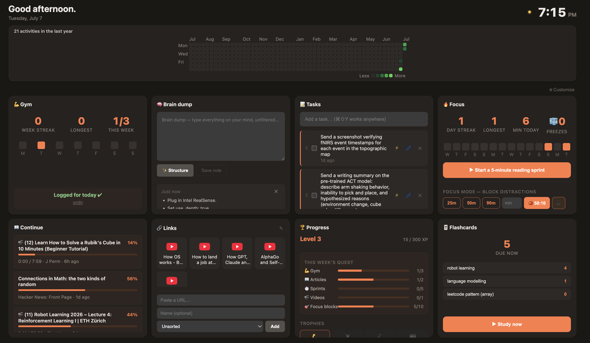

# Reader

**An RSS reader rebuilt as a full attention-management system for your browser.**

Reader helps you finish what you start, capture thoughts before they vanish,
and build the habits that keep you on track — everything runs locally, and
your data never leaves your machine unless you opt into an integration.

Built on Manifest V3 with React 19, Vite, and TypeScript.

> **This is the `personal` branch.** It carries integrations that need
> personally-registered credentials — Google Calendar, Notion push, and
> Firebase cloud sync with the iOS companion app. Setup for all of them lives
> in **[PERSONAL.md](PERSONAL.md)**. The `main` branch is the public build
> without them.



---

## Table of contents

- [Why this exists](#why-this-exists)
- [Use cases](#use-cases)
- [Features](#features)
- [Personal integrations](#personal-integrations)
- [Installation](#installation)
- [Development](#development)
- [On-device AI requirements](#on-device-ai-requirements)
- [Architecture](#architecture)
- [Permissions](#permissions)
- [Troubleshooting](#troubleshooting)
- [License](#license)

---

## Why this exists

Standard RSS readers assume you'll read what you save. In practice, articles
pile up unread, tasks get lost the moment you think of them, and focus breaks
the second a new tab opens. Reader closes that gap: it tracks what you start,
nudges you back to it, and rewards you for following through.

Everything runs locally. On-device AI uses Chrome's built-in Gemini Nano — no
API keys, no external calls (an optional bring-your-own Gemini API key can
handle harder assistant queries).

---

## Use cases

New here? These are the day-to-day flows Reader is built around — each one
works out of the box after [installation](#installation).

### 🌅 Start your day from a new tab
Open a new tab. The dashboard greets you with a short **morning briefing** —
your streak, today's first meeting, your top task, due flashcards, and the
newest unread headlines. Tap **🔊** to have it read aloud while you pour
coffee. Your agenda, tasks, and continue-reading list are one glance away.

### ⚡ Capture a thought before it slips
Press **`⌘⇧Y` / `Ctrl+Shift+Y`** anywhere in Chrome — a tiny capture window
opens, you type the task, hit Enter, and you're back to what you were doing.
Or just tell the assistant: *"add a task to email the landlord"*.

### 🎯 Sit down for deep work
Hit **`⌘K`** on the dashboard and pick **Start focus session** (or ask:
*"start a 50-minute focus"*). Distracting sites are blocked at the browser
level, the toolbar badge becomes a countdown, and quitting early takes a
deliberate 5-second hold. Pomodoro cycles, ambient music, and a calendar
time-block are one setting away.

### 🤖 Do several things in one sentence
With a Gemini API key configured, the assistant chains actions: *"add a task
to submit the report and start a 25-minute focus"* shows one plan with both
steps — confirm once and it runs them in order.

### 📚 Read more, abandon less
Add your feeds in Options and read from the popup or dashboard. Reader
remembers your scroll position in every article (and your timestamp in long
YouTube videos), surfaces a **Continue reading** list, and sends a gentle
nudge when you leave something half-finished.

### 🃏 Study what you read
On any article, open the popup and ask: *"make flashcards from this page"*.
Review the generated cards, save the keepers, and drill them later with
Anki-style spaced repetition.

### 🧠 Untangle a busy mind
Open **Brain dump**, type everything as it comes — unsorted, messy, stream of
consciousness. On-device AI structures it into bullets and proposed tasks;
nothing enters your task list until you approve it. For a task you keep
avoiding, hit **⚡ Ignition** and it suggests one tiny first action plus a
5-minute starter session.

### 🔥 Keep habits alive
One-tap gym check-ins, reading sprints, and daily streaks — with **streak
insurance** tokens for the occasional off day, and XP, levels, badges, and
weekly quests tying it all together. If your streak is at risk in the
evening or reviews are piling up, Reader sends one considerate heads-up
(quiet hours respected).

### 💭 Teach it about you
Tell the assistant *"remember that my advisor is Dr. Lee"* — remembered facts
shape its answers and your morning briefing from then on. Review or delete
them any time in **Options → Assistant → Memory**.

---

## Features

### Reading & tasks
- **RSS reader** — feeds, unread badge, filtering, and auto-refresh.
- **Quick capture** — press `⌘⇧Y` / `Ctrl+Shift+Y` anywhere in Chrome to open a
  capture window, type a task, hit Enter. Nothing is lost to a fleeting thought.
- **Reading progress & resume** — scroll position is tracked per article; the
  popup surfaces a "Continue reading" pick-up point.
- **Tab-switch nudges** — a gentle reminder fires when you leave an article
  half-read, gated against spam (delay, cooldown, per-article cap, dismiss).
- **YouTube tracking** — long videos (≥15 min, configurable) are auto-tracked
  with resume-at-timestamp and abandonment nudges. Watch time accrues even in a
  background tab, so podcast-style listening isn't penalized. Shorts and live
  streams are ignored.
- **Paper tracking** — a dedicated reading log for academic papers and
  long-form documents.

### Focus & habits
- **Focus Mode** — one-shot blocks (25 / 50 / 90 min or custom) or pomodoro
  cycles (default 50:10) that block a configurable site list via
  `declarativeNetRequest`. Enforcement survives service-worker restarts and
  browser relaunches. Ending early requires a 5-second hold.
- **Pomodoro polish** — the toolbar badge becomes a live countdown during focus
  phases, and new tabs switch to a dark focus theme with a banner countdown.
  Optional Flowtunes integration opens ambient music automatically.
- **Reading sprints & streaks** — daily streaks with a GitHub-style activity
  calendar on the dashboard.
- **Gym check-ins** — one-tap "I went today" logging, with a weekly-goal streak
  that survives rest days.
- **Hyperfocus guardrails** — a gentle notification after extended unbroken
  engagement (default 90 min), so a deep-focus session doesn't turn into a lost
  afternoon.
- **Ignition mode** — for tasks you're avoiding, an AI-suggested "first tiny
  action" kicks off a 5-minute focus session to break the inertia.

### Gamification
- Unified XP and levels across every habit — reading, tasks, gym, video,
  flashcards, and focus sessions all feed one progression system.
- A 16-badge trophy case and auto-derived weekly quests with bonus XP.
- **Mystery chests** — a small chance of bonus XP on task completion.
- **Streak insurance** — earn freeze tokens that protect a streak through a
  missed day.

### On-device AI (no API key)
- **Brain dump** — type raw, unstructured thoughts and Chrome's built-in Gemini
  Nano (on-device Prompt API) turns them into organized bullets and proposed
  tasks. Nothing leaves your machine. Dumps are saved as plain notes *before*
  structuring, so a closed window never loses your thoughts. Task creation is
  review-first — nothing enters your list until you confirm.

### Flashcards
- Anki-style spaced repetition (SM-2) with basic and cloze-deletion cards
  generated from your notes. Includes learning steps, lapses, a 30-day review
  chart, and daily new-card limits.

### Dashboard & organization
- **New-tab dashboard** — replaces Chrome's default new tab with tasks,
  continue-reading, streak heatmap, activity calendar, bookmarks, and more, laid
  out in a drag-and-drop grid you can customize and resize.
- **Bookmarks & link groups** — a curated speed-dial, independent of Chrome's
  own bookmarks, addable from the popup, dashboard, or a right-click context
  menu.
- **Dark mode** — full light / dark / system theming across every page.
- **Assistant (Jarvis)** — a chat card, popup tab, and `⌘K` command palette that
  answer questions from your own data and run actions ("add a task to…", "start
  a 25-minute focus"). On-device Gemini Nano first, optional Gemini API key
  (yours, entered in Options) for harder queries; optional push-to-talk voice
  input and spoken replies via the browser's built-in speech synthesis.
  - **Multi-step commands** (with a Gemini key) — "add these three tasks and
    start a focus session" plans a tool chain behind a single confirmation.
  - **Persistent memory** — "remember I lift Mon/Wed/Fri"; facts inform answers
    and the briefing, and are manageable in Options.
  - **Morning briefing** — a once-a-day check-in card with a 🔊 play button.
  - **Proactive check-ins** — an evening streak-at-risk / reviews-piling-up
    notification and a "meeting starts in 10 minutes" reminder, both gated by
    configurable quiet hours.

---

## Personal integrations

This branch additionally ships (setup: **[PERSONAL.md](PERSONAL.md)**):

- **Google Calendar** — a 📅 Today agenda card with a next-event countdown,
  assistant commands like "block 2–3pm for deep work" and "what's on my
  calendar tomorrow?", meetings in the morning briefing, upcoming-event
  reminders, and optional focus-session time-blocking on your calendar.
- **Notion sync (one-way)** — push links, brain dumps, tasks, and a reading log
  to your own Notion databases via an integration token.
- **Cloud sync + iOS app** — two-way Firestore sync sharing state with the
  native SwiftUI companion app in `ios/`. Off unless you configure Firebase.

---

## Installation

### Without building (share with anyone)

```bash
npm run package   # → release/install-reader.command + release/reader-extension-v1.0.0.zip
```

Send people **one file**:

- **macOS / Linux** — `install-reader.command`. Double-click (macOS) or
  `sh install-reader.command` (Linux). It self-extracts the prebuilt extension
  to `~/ReaderExtension`, opens `chrome://extensions`, and prints the one
  remaining step: enable **Developer mode** → **Load unpacked** → pick the
  `ReaderExtension` folder. No node/npm needed. Chrome doesn't allow installs
  outside the Web Store, so that one click can't be automated.
- **Windows** — the `.zip`: extract it, then Load unpacked the extracted folder.

> **On this branch:** the packaged build embeds whatever is in your
> `.env.local` (Firebase config, Google OAuth client id). Package from a clean
> env if that shouldn't ship — see [PERSONAL.md](PERSONAL.md).

### From source

```bash
npm install
npm run build     # typecheck + production build into dist/
```

1. Open `chrome://extensions`
2. Enable **Developer mode**
3. **Load unpacked** → select the `dist/` folder

> If you have an older RSS Feed Reader extension installed, disable it — this
> one replaces it and does not share storage across extension IDs.

---

## Development

```bash
npm run dev        # dev server with HMR (@crxjs/vite-plugin)
npm run build      # typecheck + production build
npm run typecheck  # tsc --noEmit
npm test           # vitest unit tests
```

---

## On-device AI requirements

Brain dump, Ignition mode, and the assistant use Chrome's built-in Prompt API
(Gemini Nano), which needs:

- Chrome 138+
- ~22 GB free disk space
- A 4 GB-VRAM GPU or 16 GB RAM

The first use triggers a one-time model download, with progress shown in the
UI. Check status at `chrome://on-device-internals`. On unsupported hardware,
brain dumps still save as plain notes.

To force eligibility on borderline hardware, enable these flags:
`chrome://flags/#optimization-guide-on-device-model` (Enabled
BypassPerfRequirement) and `chrome://flags/#prompt-api-for-gemini-nano`.

For assistant queries too long or hard for Nano, you can paste your own
Gemini API key in **Options → Assistant** — it's stored locally and used only
for those calls. Leave it blank to stay fully on-device.

---

## Architecture

- **Service worker** (`src/background/`) owns all storage writes; every
  read/write from the UI goes through a message router, so state stays
  consistent across popup, dashboard, and content scripts.
- **UI reactivity** is driven entirely by `chrome.storage.onChanged` — no
  polling.
- **Content scripts** (`src/content/`) are bundled separately via esbuild (not
  the Vite / crxjs pipeline), since `chrome.scripting.executeScript` can't
  inject ES modules. They handle reading-progress tracking, YouTube video
  tracking, and an in-page time-awareness pill.
- **Pure logic modules** (`src/shared/`) — spaced repetition, XP curves, badge
  rules, streak math, focus-block rules, and sync-merge logic — are
  dependency-free and fully unit-tested via Vitest. The same logic is mirrored
  in `ios/ADHDReaderCore` so both platforms agree.
- **Blocking** uses `declarativeNetRequest`, so Focus Mode enforcement is
  browser-level and survives service-worker termination.
- **Cloud sync** (`src/background/sync.ts`, `firestoreBackend.ts`) layers a
  pluggable, conflict-tolerant sync engine over Firestore, kept optional and
  fully decoupled from local operation.

### Project layout

```
src/
  background/   Service worker: routing, feeds, tasks, focus, sync, …
  content/      Injected trackers (reading, video, time pill)
  pages/        popup, newtab, options, capture, flashcards, papers, blocked
  shared/       Dependency-free pure logic + storage helpers
ios/
  ADHDReaderCore/   Shared Swift logic package (mirrors src/shared)
  ADHDReader/       SwiftUI app + Xcode project
```

---

## Permissions

| Permission | Why |
|---|---|
| `storage` | All extension state (feeds, tasks, streaks, settings) |
| `alarms` | Scheduled reminders, digests, badge ticks |
| `notifications` | Task reminders, streak / badge alerts |
| `scripting` | Injecting the reading / video trackers |
| `declarativeNetRequest` | Focus Mode site blocking |
| `contextMenus` | Right-click "Bookmark in Reader" |
| `identity` | Google Calendar OAuth (this branch only) |
| `<all_urls>` (host) | Tracking reading / video progress on any site; Notion & Firestore API calls |

---

## Troubleshooting

**Notifications on macOS.** Task reminders use Chrome's notification API. If
nothing appears, check **System Settings → Notifications → Google Chrome** —
Chrome silently no-ops when the OS-level permission is off.

**AI unavailable.** Confirm your hardware meets the
[on-device AI requirements](#on-device-ai-requirements) and check model status
at `chrome://on-device-internals`. Brain dumps still save as plain notes on
unsupported hardware.

**Cloud sync not working.** Ensure `.env.local` is filled in and you've rebuilt
(`npm run build`). A blank `VITE_FIREBASE_API_KEY` disables sync by design.

---

## License

MIT — see [LICENSE](LICENSE).
