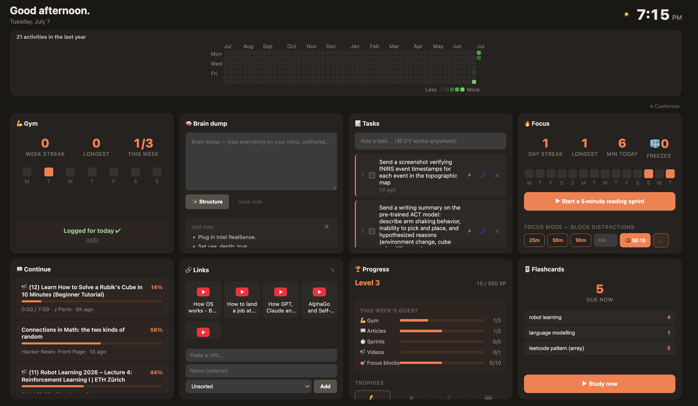

# Reader

**An RSS and document reader that tracks what you start, brings you back to it,
and blocks what pulls you away.**

Everything runs locally. Nothing is sent anywhere, because there is nowhere for
it to be sent — no accounts, no API keys, no network calls except fetching the
feeds and documents you asked for.

Built on Manifest V3 with React 19, Vite, and TypeScript.



---

## What this is, and what it deliberately is not

Reader does the things a browser extension is uniquely placed to do: it sits
inside the browser, so it can see what you actually opened, how far you got,
and what you wandered off to instead.

It does **not** keep your notes, your tasks, your meeting notes, or your job
applications. It used to. All of it was a worse version of a tool most people
already have open in the next tab — so it was removed rather than maintained
half-heartedly. Reader is meant to sit alongside Notion (or whatever you use),
not compete with it.

There is also no AI. No on-device model, no API key, no assistant. That is what
keeps the permission list short and the behaviour predictable.

---

## Features

### Reading

- **RSS reader** — feeds, unread badge, auto-refresh on an interval you pick.
- **Reading progress and resume** — scroll position and active reading time are
  tracked per article; the new tab surfaces a "Continue reading" list.
- **Come-back nudges** — a reminder fires when you leave an article half-read,
  gated against spam (a delay before it fires, a per-article cooldown, a cap,
  and a dismiss that sticks).
- **Hyperfocus check-in** — a gentle notification after a long unbroken run of
  reading or watching, so a deep session doesn't quietly eat the afternoon.

### The reader itself

PDF links (arXiv, DOIs, course readings) open in an in-extension reader instead
of Chrome's bare viewer, the way Google Scholar's PDF reader works — with a
one-click "Open in Chrome's viewer" escape hatch that's remembered for the
session. Web articles can be opened the same way with `⌘/Ctrl+Shift+E`.

- **Highlights and sticky notes** — four colours and free-floating notes, with a
  sidebar to jump between them. Annotations are keyed to the document, so they
  work on untracked PDFs and survive arXiv `abs`/`pdf` URL variants.
- **Inline citation lookup** — hover a citation marker (`[12]` or author-year)
  to see the full bibliography entry, with a link out to the arXiv/DOI/URL it
  names. A citation pointing at a paper you already track links to *your* copy.
- **Document outline** — the PDF's own headings, for jumping around long
  documents.
- **Find in document**, and **resume where you left off** — exact page and
  scroll position, flushed the moment you switch or close the tab.

### Papers

A reading log for academic papers, organised into decks. Each paper carries
title, authors, venue, year, citation count, abstract, a "why this matters to
me" note, and a status (to-read → reading → read).

The part that earns its place: opening a tracked paper in the reader
**advances it automatically**. The percentage only ratchets up, the status flips
to "reading" on first open, and a "left off at Section 4.2" note records the
heading you last reached. New PDFs get a slim track prompt that prefetches
metadata (arXiv URLs resolve via Semantic Scholar) into a short form.

### YouTube

Long videos (≥15 min) are auto-tracked with resume-at-timestamp and abandonment
nudges. While one is playing, the side panel shows a live row — title, position,
current chapter — with a **Follow** pane that scrolls the transcript to the
block being spoken. Watch time accrues even in a background tab, so
podcast-style listening isn't penalised. Shorts and live streams are ignored.

### Focus

- **Focus Mode** — one-shot blocks or pomodoro cycles that block a configurable
  site list via `declarativeNetRequest`, so enforcement is browser-level and
  survives service-worker restarts and browser relaunches. Ending early requires
  a 5-second hold.
- The toolbar badge becomes a live countdown during focus phases, and a blocked
  site shows an interstitial with the time remaining.
- Optional Flowtunes integration opens ambient music when a session starts.

### Elsewhere

- **New-tab dashboard** — Continue reading, plus a speed dial of bookmarks and
  link groups (independent of Chrome's own bookmarks, addable from the side
  panel or a right-click).
- **Side panel** — acts on the page you're looking at: read it, bookmark it,
  start a focus block.
- **Theming** — light / dark / system, with an accent that can match Chrome or
  Brave. Type is Atkinson Hyperlegible throughout, chosen for low-vision
  legibility; translucency is honoured or dropped according to your system's
  Reduce Transparency setting.

---

## Installation

### Easiest — you cloned this repo

Run the installer for your system. It builds the extension and opens Chrome to
the last step.

- **macOS** — double-click `install.command` in Finder.
- **Windows** — double-click `install.bat` in File Explorer.
- **Linux** — run `sh install.command`.

The only thing it needs is [Node.js](https://nodejs.org). When it finishes,
Chrome opens to `chrome://extensions`: turn on **Developer mode**, click
**Load unpacked**, and pick the `dist` folder it points you to.

### Without building (share with anyone)

```bash
npm run package   # → release/install-reader.command + release/reader-extension-v1.0.0.zip
```

- **macOS / Linux** — send `install-reader.command`. It self-extracts to
  `~/ReaderExtension`, opens `chrome://extensions`, and prints the one remaining
  step. No node/npm needed.
- **Windows** — send the `.zip`: extract it, then Load unpacked the folder.

Chrome doesn't allow installs outside the Web Store, so that last click can't be
automated.

### From source

```bash
npm install
npm run build     # typecheck + production build into dist/
```

Then `chrome://extensions` → Developer mode → Load unpacked → `dist/`.

---

## Development

```bash
npm run dev        # dev server with HMR (@crxjs/vite-plugin)
npm run build      # typecheck + production build
npm run typecheck  # tsc --noEmit
npm test           # vitest unit tests
```

---

## Architecture

- **Service worker** (`src/background/`) owns all storage writes; every
  read/write from the UI goes through a message router, so state stays
  consistent across side panel, dashboard, and content scripts.
- **UI reactivity** is driven entirely by `chrome.storage.onChanged` — no
  polling.
- **Content scripts** (`src/content/`) are bundled separately via esbuild (not
  the Vite / crxjs pipeline), since `chrome.scripting.executeScript` can't
  inject ES modules. They handle reading-progress tracking, YouTube video
  tracking, and a MAIN-world tee that captures the YouTube player's own caption
  request.
- **Pure logic modules** (`src/shared/`) — streak-free reading math, focus-block
  rules, annotation anchoring, citation parsing — are dependency-free and unit
  tested with Vitest.
- **Blocking** uses `declarativeNetRequest`, so Focus Mode enforcement is
  browser-level and survives service-worker termination.

### Project layout

```
src/
  background/   Service worker: routing, feeds, focus, tracking, papers
  content/      Injected trackers (reading, video, caption tee)
  pages/        newtab, sidepanel, options, reader, papers, blocked
  shared/       Dependency-free pure logic + storage helpers
```

---

## Permissions

| Permission | Why |
|---|---|
| `storage` | Everything is stored locally |
| `alarms` | Feed refresh, focus phase ends, come-back nudges |
| `notifications` | Nudges and focus-phase notifications |
| `scripting` | Injecting the reading and video trackers |
| `declarativeNetRequest` | Focus Mode site blocking |
| `webRequest` | Read-only: response headers, to spot PDFs served from extensionless URLs |
| `contextMenus` | "Read in Reader" and "Bookmark this page" |
| `sidePanel` | The side panel |
| `<all_urls>` | Trackers are injected into whatever page you're reading |

No `identity`, no `tabCapture`, no `offscreen`. The extension has no account and
makes no authenticated request to anyone.

---

## Troubleshooting

**Keyboard shortcut doesn't work.** Chrome only binds a suggested key if it is
free and you have not customised your shortcuts. Check
`chrome://extensions/shortcuts`.

**A PDF opened in Chrome's viewer instead.** Some hosts serve PDFs from
extensionless URLs that only reveal themselves in the response headers; if the
tab has already committed there is nothing to intercept. Use the context menu or
`⌘/Ctrl+Shift+E`.

**A YouTube transcript won't load.** YouTube gates the caption endpoint behind a
token the player mints. The extension reads what the player already loaded, so
the video's tab has to be open — and a tab opened before the extension was
installed or updated needs one reload.

**Nudges never appear.** Chrome notifications can be blocked at the OS level.
On macOS: System Settings → Notifications → Google Chrome. Settings will tell
you if this is the case.

---

## License

MIT — see [LICENSE](LICENSE).
