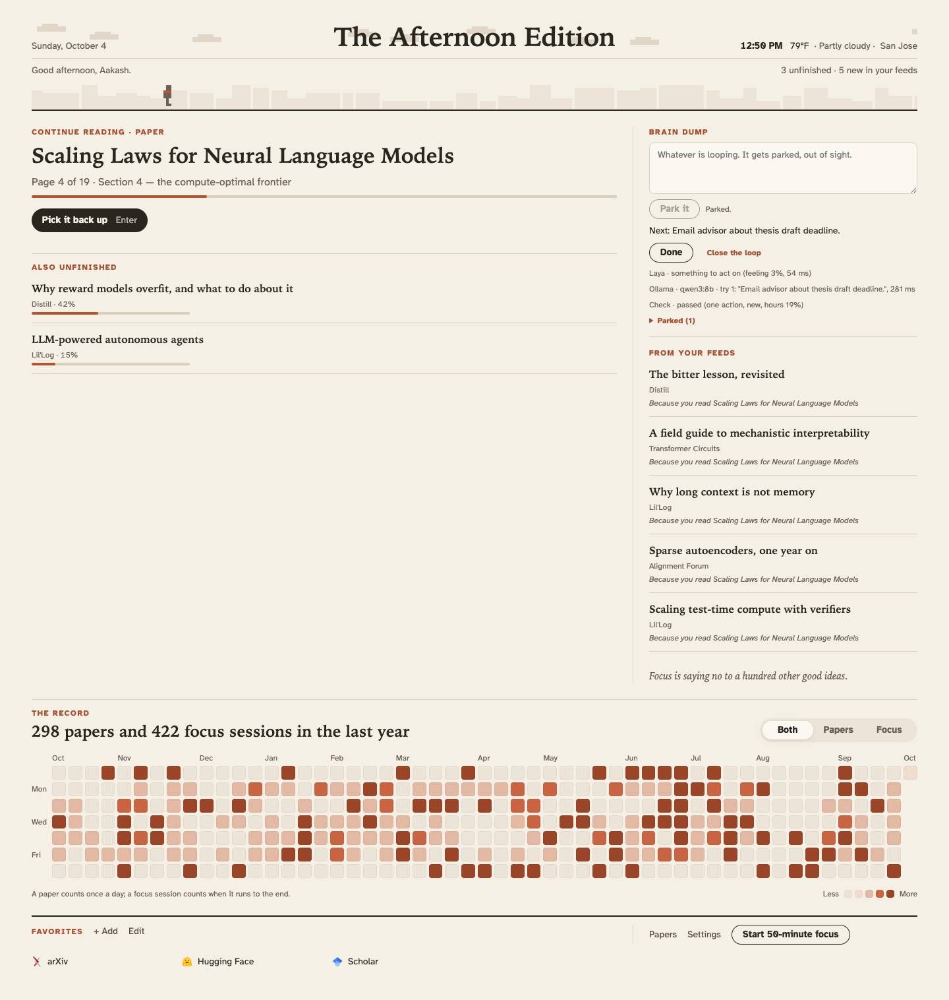
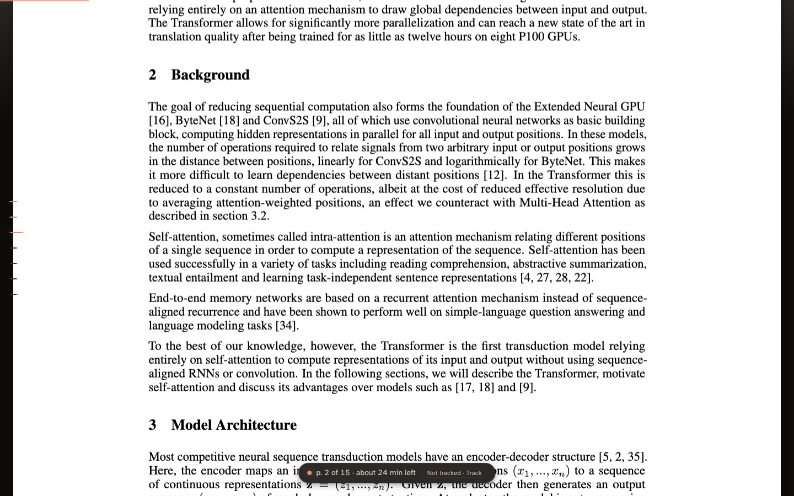
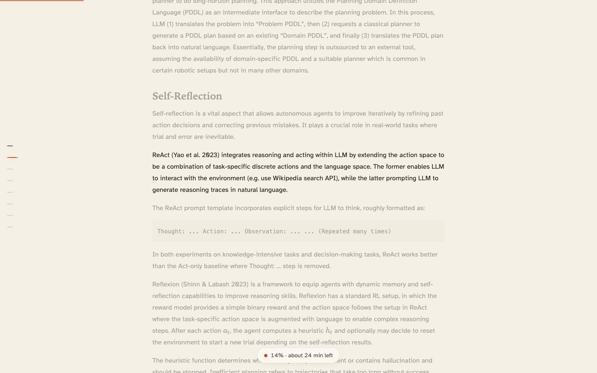
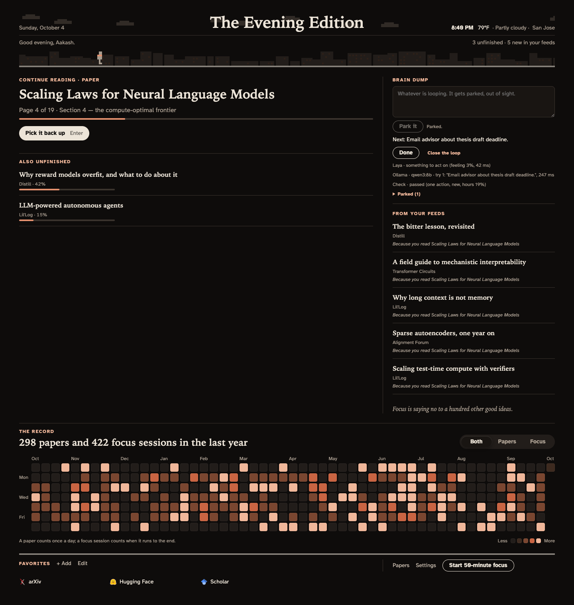
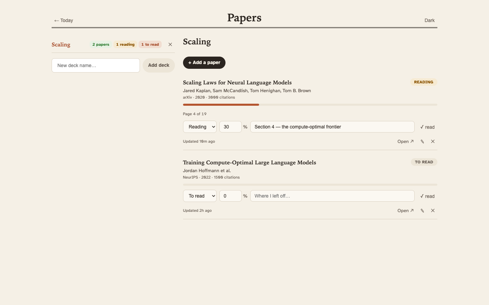

# Reader

**An RSS and document reader that tracks what you start, brings you back to it,
and blocks what pulls you away.**

Everything runs locally. No accounts, and no network calls except fetching the
feeds and documents you asked for — plus, only if you set them up, your own
Ollama server and (for public sources only) Claude with your own key.

Built on Manifest V3 with React 19, Vite, and TypeScript.



<table>
  <tr>
    <td></td>
    <td></td>
  </tr>
  <tr>
    <td align="center"><sub>Reading a paper — the chrome sleeps, the page stays</sub></td>
    <td align="center"><sub>The focus line (press F)</sub></td>
  </tr>
  <tr>
    <td></td>
    <td></td>
  </tr>
  <tr>
    <td align="center"><sub>The evening edition, in warm ink</sub></td>
    <td align="center"><sub>The papers library</sub></td>
  </tr>
</table>

---

## What this is, and what it deliberately is not

Reader does the things a browser extension is uniquely placed to do: it sits
inside the browser, so it can see what you actually opened, how far you got,
and what you wandered off to instead.

It does **not** keep your notes, your tasks, your meeting notes, or your job
applications. It used to. All of it was a worse version of a tool most people
already have open in the next tab — so it was removed rather than maintained
half-heartedly. Reader is meant to sit alongside Notion (or whatever you use),
not compete with it.

There is no assistant either. The AI that is here serves the reading: a recap of
where you left off, a feed ranked by what you actually finish, questions answered
from the document in front of you, and search over your own highlights. It runs
on your machine through [Ollama](https://ollama.com) and is off until you pick a
model. Claude can take over for public sources (feeds, arXiv/DOI papers, YouTube)
if you add your own key; a web page you opened, a local PDF or your highlights
never leave the machine, whatever the settings say.

---

## Features

### The new tab — today's edition

The new tab is laid out like the front page of a newspaper, so opening the
browser is a reason to start, not a list to manage:

- **The masthead is the greeting** — *The Morning Edition*, *Afternoon*,
  *Evening*, or *The Late Edition* before 5am — with the date, time and weather.
- **The lead story is the one thing you left unfinished**: a paper ("Page 4 of
  19 · Section 4 — the compute-optimal frontier"), an article or a video, with
  one primary button. Enter opens it; J and K walk every story on the page.
- **From your feeds** — five unread items ranked against what you finish, each
  with the reason it is there.
- **The index** along the bottom: favorites, Papers, Settings and a focus block.

### Reading

- **RSS reader** — feeds, unread badge, auto-refresh on an interval you pick.
- **Reading progress and resume** — scroll position and active reading time are
  tracked per article; the new tab surfaces a "Continue reading" list.
- **Come-back nudges** — a reminder fires when you leave an article half-read,
  gated against spam (a delay before it fires, a per-article cooldown, a cap,
  and a dismiss that sticks).
- **Hyperfocus check-in** — a gentle notification after a long unbroken run of
  reading or watching, so a deep session doesn't quietly eat the afternoon.

### The reader itself

PDF links (arXiv, DOIs, course readings) open in an in-extension reader instead
of Chrome's bare viewer, the way Google Scholar's PDF reader works — with a
one-click "Open in Chrome's viewer" escape hatch that's remembered for the
session. Web articles can be opened the same way with `⌘/Ctrl+Shift+E`.

The reader is built so you don't drift off mid-paper:

- **The chrome sleeps.** The toolbar fades a moment after you start reading and
  comes back at the top edge, on scroll-up, or when it has keyboard focus.
- **Status without noise.** A thin clay line across the top shows how far
  through you are; a capsule under the page shows the page and minutes left.
  Click it for page jump and zoom.
- **Section rail.** The outline rests as tick marks on the left edge, the
  current section lit; finishing one says so — "Section 3 done · 2 left".
- **Focus line.** Press F and everything but the passage you are reading dims
  (a soft reading band on PDFs). Text stays selectable through it.
- **Drift nudge.** Three quiet minutes, or coming back after two minutes in
  another tab, and the capsule offers "You were at 3.2 Attention · Back".

- **Highlights and sticky notes** — four colours and free-floating notes, with a
  sidebar to jump between them. Annotations are keyed to the document, so they
  work on untracked PDFs and survive arXiv `abs`/`pdf` URL variants.
- **Inline citation lookup** — hover a citation marker (`[12]` or author-year)
  to see the full bibliography entry, with a link out to the arXiv/DOI/URL it
  names. A citation pointing at a paper you already track links to *your* copy.
- **Document outline** — the PDF's own headings, for jumping around long
  documents.
- **Find in document**, and **resume where you left off** — exact page and
  scroll position, flushed the moment you switch or close the tab.

### Papers

A reading log for academic papers, organised into decks. Each paper carries
title, authors, venue, year, citation count, abstract, a "why this matters to
me" note, and a status (to-read → reading → read).

The part that earns its place: opening a tracked paper in the reader
**advances it automatically**. The percentage only ratchets up, the status flips
to "reading" on first open, and a "left off at Section 4.2" note records the
heading you last reached. An untracked PDF shows a small "Not tracked · Track"
chip in the capsule; it prefetches metadata (arXiv URLs resolve via Semantic
Scholar) into a short form.

### YouTube

Long videos (≥15 min) are auto-tracked with resume-at-timestamp and abandonment
nudges. While one is playing, the new tab shows a **Now watching** card — title,
position, current chapter — with a **Follow** pane that scrolls the transcript
to the block being spoken. Watch time accrues even in a background tab, so
podcast-style listening isn't penalised. Shorts and live streams are ignored.

### Focus

- **Focus Mode** — timed blocks that block a configurable
  site list via `declarativeNetRequest`, so enforcement is browser-level and
  survives service-worker restarts and browser relaunches. Ending early requires
  a 5-second hold.
- The toolbar badge becomes a live countdown during focus phases, and a blocked
  site shows an interstitial with the time remaining.
- Optional Flowtunes integration opens ambient music when a session starts.

### Elsewhere

- **The new tab is the only surface**, and where the toolbar icon lands.
  Favorites are independent of Chrome's own bookmarks (addable inline or by
  right-clicking a page). Reading or bookmarking the page you're on is the
  keyboard shortcut and the right-click menu, which work from the page itself.
- **Design** — paper and ink in light mode, warm ink in dark, one clay accent.
  Headlines are set in the system serif; body text is Atkinson Hyperlegible,
  chosen for low-vision legibility, never thinner than 12px and never pure white
  on black. Translucency is honoured or dropped according to your system's
  Reduce Transparency setting.

---

## Installation

### Easiest — you cloned this repo

Run the installer for your system. It builds the extension and opens Chrome to
the last step.

- **macOS** — double-click `install.command` in Finder.
- **Windows** — double-click `install.bat` in File Explorer.
- **Linux** — run `sh install.command`.

The only thing it needs is [Node.js](https://nodejs.org). When it finishes,
Chrome opens to `chrome://extensions`: turn on **Developer mode**, click
**Load unpacked**, and pick the `dist` folder it points you to.

### Without building (share with anyone)

```bash
npm run package   # → release/install-reader.command + release/reader-extension-v1.0.0.zip
```

- **macOS / Linux** — send `install-reader.command`. It self-extracts to
  `~/ReaderExtension`, opens `chrome://extensions`, and prints the one remaining
  step. No node/npm needed.
- **Windows** — send the `.zip`: extract it, then Load unpacked the folder.

Chrome doesn't allow installs outside the Web Store, so that last click can't be
automated.

### From source

```bash
npm install
npm run build     # typecheck + production build into dist/
```

Then `chrome://extensions` → Developer mode → Load unpacked → `dist/`.

---

## Development

```bash
npm run dev        # dev server with HMR (@crxjs/vite-plugin)
npm run build      # typecheck + production build
npm run typecheck  # tsc --noEmit
npm test           # vitest unit tests (includes the design-system lint)
```

CI (`.github/workflows/ci.yml`) runs typecheck, tests and build on every push
and pull request.

### The design system

Every visual decision is a token in `src/shared/theme.css`: colours for both
themes, a type scale with paired line heights on a 4px baseline, spacing in 4px
steps, radii, and a 12-column grid (`.grid`) that every page lays itself out on.
`src/shared/designSystem.test.ts` reads every stylesheet and fails the build on
a raw colour outside `theme.css`, spacing off the 4px grid, a font size or line
height off the scale, a font weight other than 400/700, or a radius that is not
a token. `theme.test.ts` checks that light and dark define the same tokens and
that text clears WCAG contrast (4.5:1) in both. A rare, justified exception
carries a `/* ds-exempt: reason */` comment.

---

## Architecture

- **Service worker** (`src/background/`) owns all storage writes; every
  read/write from the UI goes through a message router, so state stays
  consistent across the dashboard, the reader, and content scripts.
- **UI reactivity** is driven entirely by `chrome.storage.onChanged` — no
  polling.
- **Content scripts** (`src/content/`) are bundled separately via esbuild (not
  the Vite / crxjs pipeline), since `chrome.scripting.executeScript` can't
  inject ES modules. They handle reading-progress tracking, YouTube video
  tracking, and a MAIN-world tee that captures the YouTube player's own caption
  request.
- **Pure logic modules** (`src/shared/`) — streak-free reading math, focus-block
  rules, annotation anchoring, citation parsing — are dependency-free and unit
  tested with Vitest.
- **Blocking** uses `declarativeNetRequest`, so Focus Mode enforcement is
  browser-level and survives service-worker termination.

### Project layout

```
src/
  background/   Service worker: routing, feeds, focus, tracking, papers
  content/      Injected trackers (reading, video, caption tee)
  pages/        newtab, options, reader, papers, blocked
  shared/       Dependency-free pure logic + storage helpers
```

---

## Permissions

| Permission | Why |
|---|---|
| `storage` | Everything is stored locally |
| `alarms` | Feed refresh, focus phase ends, come-back nudges |
| `notifications` | Nudges and focus-phase notifications |
| `scripting` | Injecting the reading and video trackers |
| `declarativeNetRequest` | Focus Mode site blocking |
| `webRequest` | Read-only: response headers, to spot PDFs served from extensionless URLs |
| `contextMenus` | "Read in Reader" and "Bookmark this page" |
| `<all_urls>` | Trackers are injected into whatever page you're reading; also reaches your Ollama server |

No `identity`, no `tabCapture`, no `offscreen`. The extension has no account.
The only authenticated request it can make is to Claude, with a key you added,
for public sources you allowed.

---

## Troubleshooting

**Keyboard shortcut doesn't work.** Chrome only binds a suggested key if it is
free and you have not customised your shortcuts. Check
`chrome://extensions/shortcuts`.

**A PDF opened in Chrome's viewer instead.** Some hosts serve PDFs from
extensionless URLs that only reveal themselves in the response headers; if the
tab has already committed there is nothing to intercept. Use the context menu or
`⌘/Ctrl+Shift+E`.

**A YouTube transcript won't load.** YouTube gates the caption endpoint behind a
token the player mints. The extension reads what the player already loaded, so
the video's tab has to be open — and a tab opened before the extension was
installed or updated needs one reload.

**Nudges never appear.** Chrome notifications can be blocked at the OS level.
On macOS: System Settings → Notifications → Google Chrome. Settings will tell
you if this is the case.

---

## License

MIT — see [LICENSE](LICENSE).
